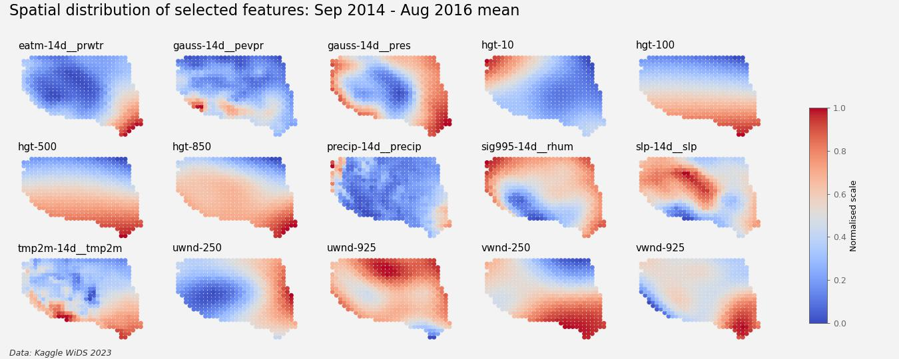
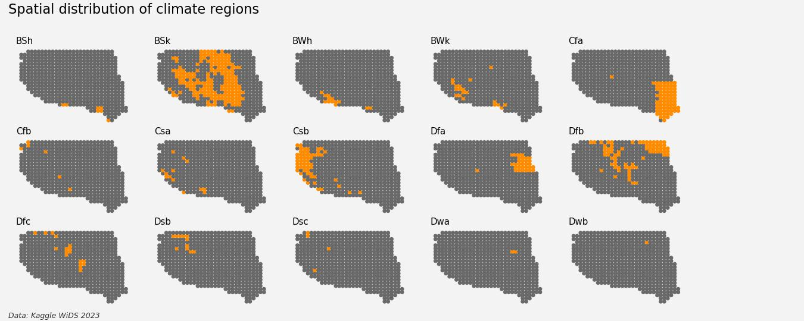
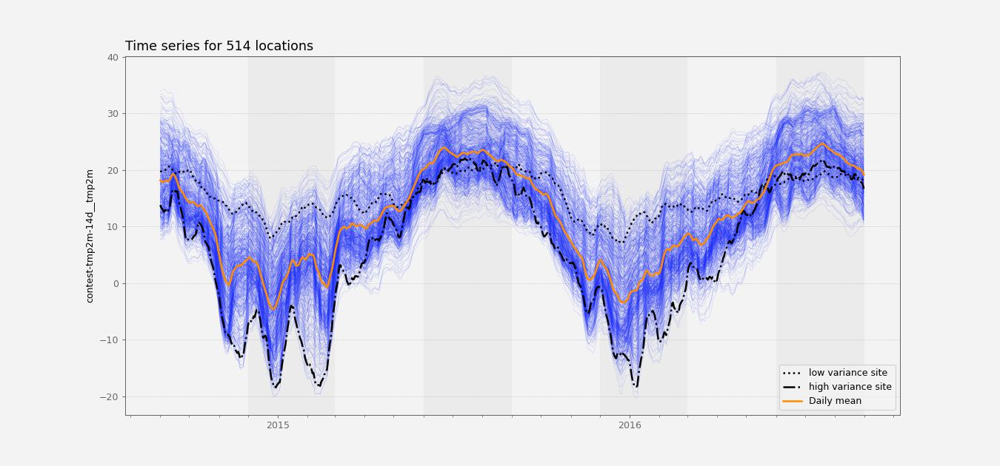
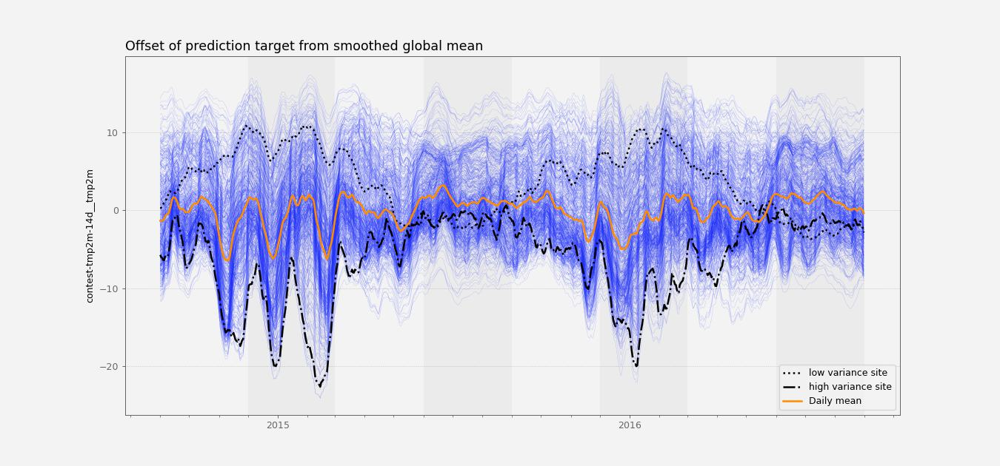
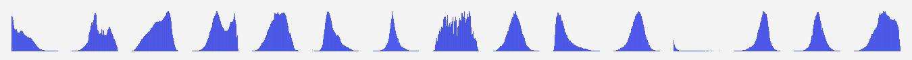
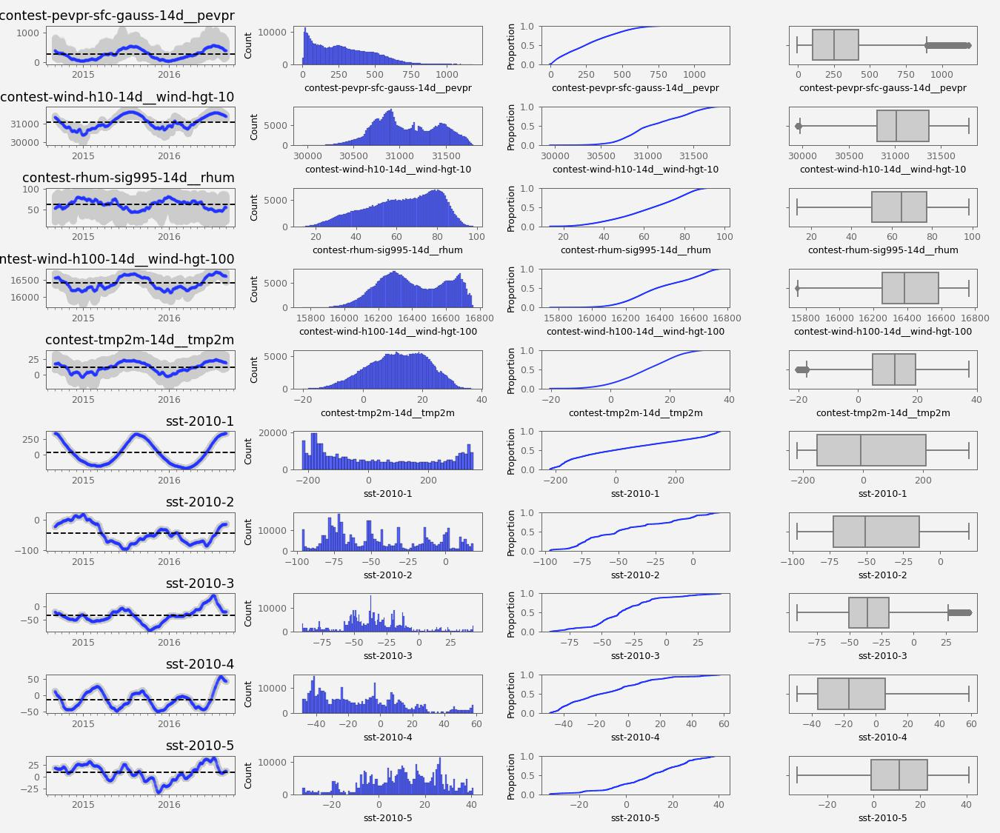

# Exploring multiple time series with matplotlib
*The jupyter notebook contains miscellaneous python plotting functions to draw out features of data distributed over time and space. It is not meant to be a comprehensive exploration of a particular dataset - just a gathering together of helpful functions created during the Kaggle WIDS23 datathon hat might be applicable to similar datasets with  minor modifications.*

---

### The Data
Kaggle WiDS 2023 dataset. ie 2 full years of data from 514 locations in the US. In total around 550 MB. This consists of :-
- location specific data: anonymised latitude and longitude, elevation, climate classification
- global data : daily time series of climate features eg relating to wind, sea surface temperature, ice extent, ENSO  
- local time series : daily local weather features and monthly forcasts eg relating to wind, precipitation, temperature

The dataset is too large to be included here. Visit the [Kaggle competition data page](https://www.kaggle.com/competitions/widsdatathon2023/data) for further information or to download a copy.

### 1. Geospatial distribution 

#### 2. Time series

#### 3. Features

