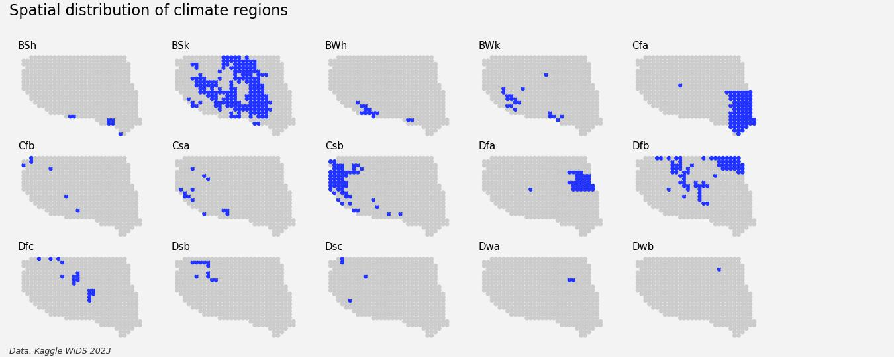

# Exploring multiple time series with matplotlib
*A miscellany of python plotting functions to draw out features of data distributed over time and space. This is not meant to be a comprehensive exploration of a particular dataset - just a gathering together of helpful functions created during the Kaggle WIDS23 datathon.*

---

### The Data
Kaggle WiDS 2023 dataset. ie 2 full years of data from 514 locations in the US. In total around 550 MB. This consists of :-
- location specific data (lat, lon, elevation, climate region)
- global data ie independent of location (time series of climate features eg relating to wind, sea surface temperature, mei etc)
- local time series (local weather features and forcasts eg relating to wind, precipitation, temperature)

The dataset is too large to be included here. Visit the [Kaggle competition data page](https://www.kaggle.com/competitions/widsdatathon2023/data) for further information.

### 1. Geospatial distribution 
(See A1)

#### 2. Time series

#### 3. Features

#### 4. Error analysis
